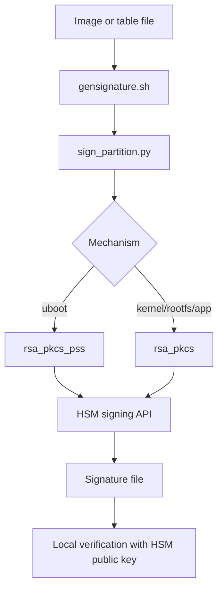
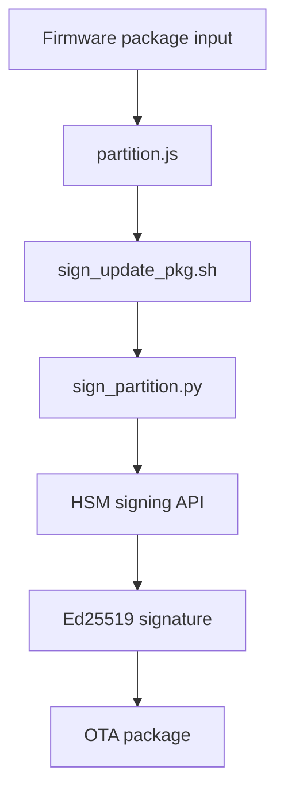
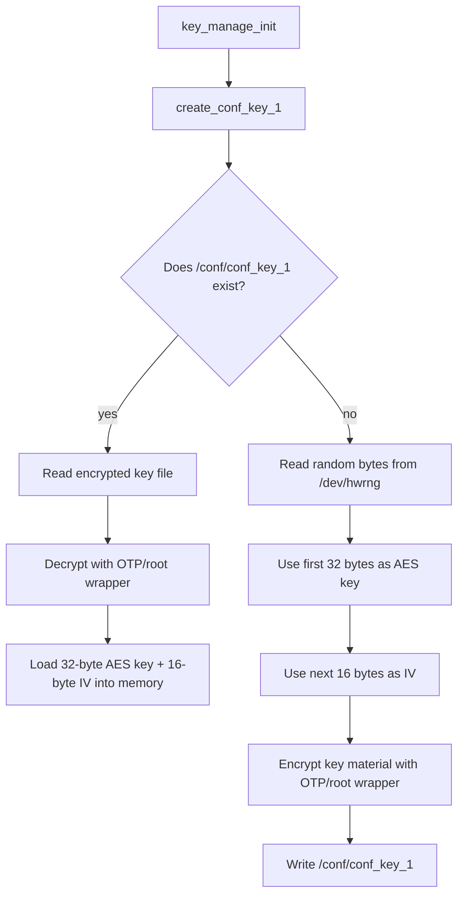
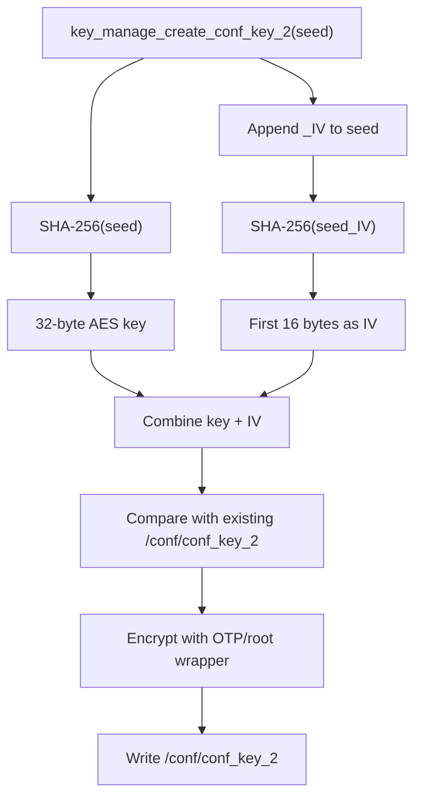
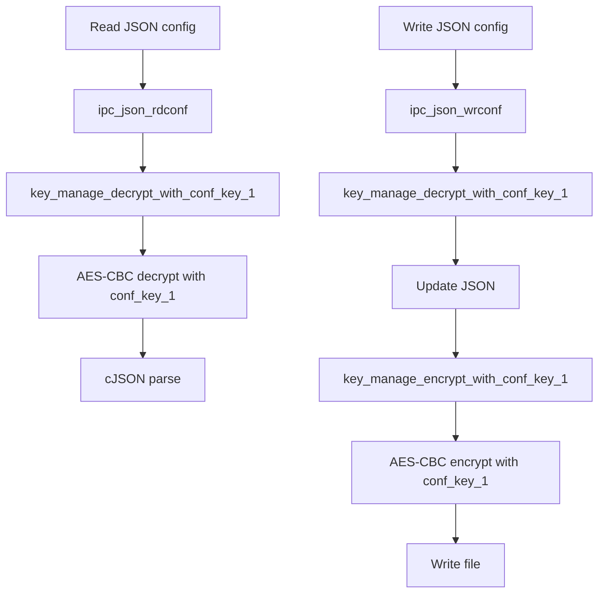
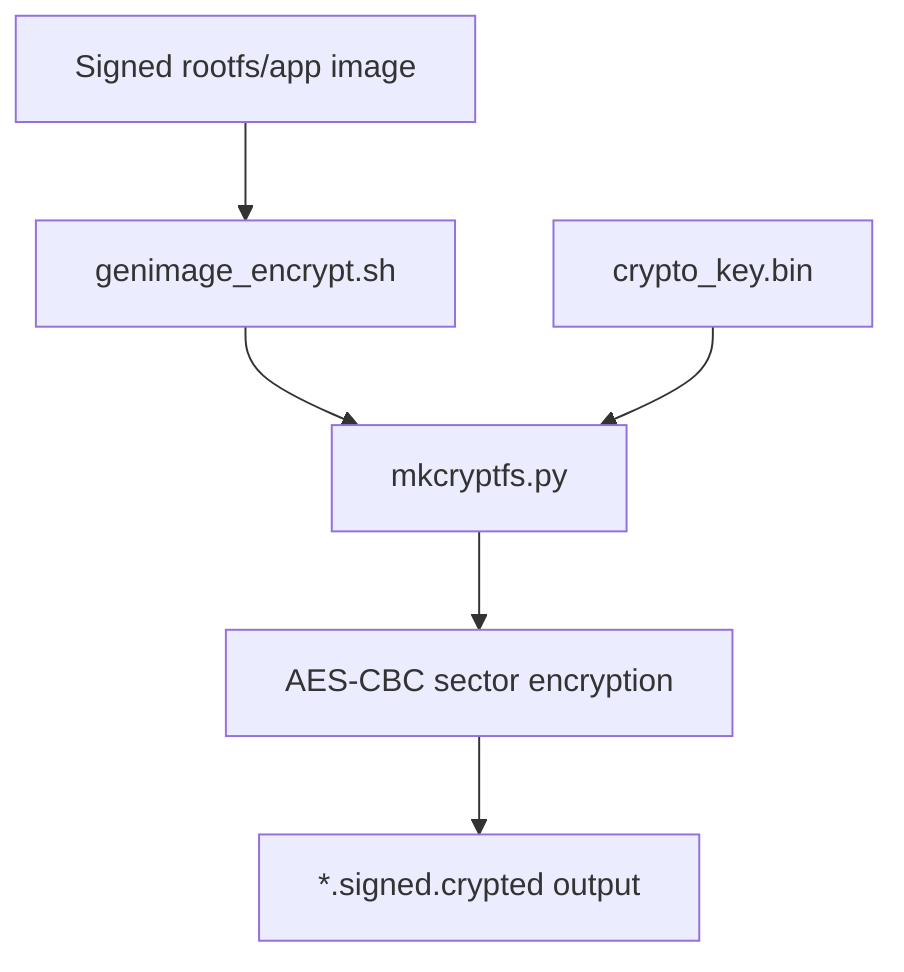

# Key Generation And Usage

## Key Inventory

| Key / Material                                    | Type                                    | Generated Where                                             | Stored Where                                                                               | Used For                                                        | Evidence                                                                                                             |
| ------------------------------------------------- | --------------------------------------- | ----------------------------------------------------------- | ------------------------------------------------------------------------------------------ | --------------------------------------------------------------- | -------------------------------------------------------------------------------------------------------------------- |
| `rts3917_sec_boot`                              | HSM RSA key                             | Outside this repo, managed by HSM                           | HSM                                                                                        | Secure boot and partition signing: uboot, kernel, rootfs, app   | `chip/rts3917/build_security_image/gensignature.sh`, `chip/rts3917/build_security_image/sign_partition.py`       |
| `ipc_upgrade_key`                               | HSM Ed25519 / EdDSA key                 | Outside this repo, managed by HSM                           | HSM                                                                                        | OTA / firmware update package signing                           | `chip/rts3917/fw/sign_update_pkg.sh`, `chip/rts3917/fw/partition.js`                                             |
| `conf_key_1`                                    | AES-256-CBC key + IV                    | Device runtime, from`/dev/hwrng`                          | `/conf/conf_key_1`, encrypted before storage                                             | Encrypt/decrypt JSON configuration under`/conf/ipc/`          | `cam/ipc_core/ipc_tool/src/ipc_key_manage.c`, `cam/ipc_core/ipc_tool/src/ipc_json.c`                             |
| `conf_key_2`                                    | AES-256-CBC key + IV                    | Device runtime, derived from a seed with SHA-256            | `/conf/conf_key_2`, encrypted before storage                                             | Secondary local AES encryption/decryption API                   | `cam/ipc_core/ipc_tool/src/ipc_key_manage.c`                                                                       |
| OTP/root wrapping material                        | AES wrapping material                   | Device runtime, from`/dev/hwrng`, written via `otp_mfg` | RTS OTP / nvmem                                                                            | Protect local config keys before writing to`/conf`            | `cam/ipc_core/ipc_tool/src/ipc_key_manage.c`                                                                       |
| Ed25519 public key for update package             | Public verification key                 | Built into firmware code                                    | C source constant                                                                          | Verify OTA/update package signature                             | `cam/updater/update_pack_decode.c`                                                                                 |
| Ed25519 public key for runtime dynamic components | Public verification key                 | Built into firmware code                                    | C source constant                                                                          | Verify signed dynamic library and factory binary                | `cam/ipc_middleware/src/ipc_decrypt.c`, `cam/ipc_middleware/src/ipc_factory.c`                                   |
| `crypto_key.bin`                                | AES filesystem encryption key file      | Build environment input                                     | `chip/rts3917/build_security_image/crypto_key/crypto_key.bin` path referenced by scripts | Encrypt signed rootfs/app images with AES-CBC sector encryption | `chip/rts3917/build_security_image/genimage_encrypt.sh`, `chip/rts3917/build_security_image/tools/mkcryptfs.py`  |
| `verity_key*.der`                               | RSA public keys / verification material | Derived from`rts3917_sec_boot.pem` public key             | rootfs`/etc/keys/` and SDK target output                                                 | dm-verity / partition signature verification                    | `chip/rts3917/build_security_image/public_key/get_hash.sh`, `chip/rts3917/fw/rootfs/rootfs_ipcrt/etc/fstab.user` |

## Flowcharts

### HSM Secure Boot Signing



### HSM OTA Package Signing



### `conf_key_1` Generation



### `conf_key_2` Generation



### Runtime Config AES Usage



### Filesystem Image Encryption



## Code Evidence

### HSM public key retrieval

File: `chip/rts3917/build_security_image/sign_partition.py`

```python
def get_public_key(server_url, token, key_name, public_key_path):
    """Retrieve public key from HSM using HTTPS"""
    if os.path.exists(public_key_path):
        print(f"✅ Public key already exists: {public_key_path}")
        return True

    print("🔑 Retrieving public key from HSM...")

    session = setup_https_session()
    if not session:
        print("❌ Failed to setup HTTPS session for public key retrieval")
        return False

    try:
        response = session.get(
            f"{HTTPS_SERVER_URL}/api/v1/keys/{key_name}",
            headers={"Authorization": f"Bearer {token}"},
            timeout=30
        )

        if response.status_code == 200:
            try:
                data = response.json()
                public_key = data.get("public_key", "")

                if public_key:
                    with open(public_key_path, 'w') as f:
                        f.write(public_key)
                    print(f"✅ Public key saved: {public_key_path}")
                    return True
```

This code retrieves only the public key from HSM. It does not create the private key.

### HSM signing request

File: `chip/rts3917/build_security_image/sign_partition.py`

```python
def sign_file(server_url, token, file_to_sign, key_name, mechanism, signature_file, hash_alg, salt_len):
    """Sign file using HSM via HTTPS"""
    print("🔐 Signing file...")

    session = setup_https_session()
    if not session:
        print("❌ Failed to setup HTTPS session for signing")
        return False

    try:
        if mechanism.startswith("rsa_"):
            file_hash = calculate_file_hash(file_to_sign, hash_alg)
            files = {'file': (file_to_sign, file_hash, 'application/octet-stream')}

            data = {
                'key_name': key_name,
                'mechanism': mechanism,
                'skip_hash_calculation': 'true',
                'hash_algorithm': hash_alg
            }

            if mechanism == "rsa_pkcs_pss" and salt_len:
                data['salt_length'] = salt_len

            response = session.post(
                f"{HTTPS_SERVER_URL}/api/v1/sign/file",
                headers={"Authorization": f"Bearer {token}"},
                files=files,
                data=data,
                timeout=60
            )

        else:
            with open(file_to_sign, 'rb') as f:
                files = {'file': f}

                data = {
                    'key_name': key_name,
                    'mechanism': mechanism,
                    'skip_hash_calculation': 'true'
                }

                if mechanism == "eddsa":
                    data['curve'] = 'ed25519'

                response = session.post(
                    f"{HTTPS_SERVER_URL}/api/v1/sign/file",
                    headers={"Authorization": f"Bearer {token}"},
                    files=files,
                    data=data,
                    timeout=60
                )
```

RSA signs a locally calculated SHA-256 digest. EdDSA signs through the HSM API with `curve = ed25519`.

### Signing mechanism selection

File: `chip/rts3917/build_security_image/sign_partition.py`

```python
parser.add_argument('file_to_sign', help='File to sign')
parser.add_argument('key_name', nargs='?', default=DEFAULT_KEY_NAME, help='HSM key name')
parser.add_argument('mechanism', choices=['rsa_pkcs_pss', 'rsa_pkcs', 'eddsa'], help='Signing mechanism')
parser.add_argument('signature_file', help='Output signature file path (REQUIRED)')
```

```python
hash_alg = "sha256"
salt_len = ""

if args.mechanism == "eddsa":
    print("ℹ️  Ed25519: 64-byte signatures, built-in hashing")
elif args.mechanism == "rsa_pkcs_pss":
    salt_len = "32"
    print("ℹ️  RSA-PSS: SHA-256, 32-byte salt")
elif args.mechanism == "rsa_pkcs":
    print("ℹ️  RSA-PKCS#1: SHA-256")
```

### Secure boot signing calls

File: `chip/rts3917/build_security_image/gensignature.sh`

```bash
python3 ./sign_partition.py ${SIG_FILE_DIR}/tb_fw_to_sig.crt  rts3917_sec_boot rsa_pkcs_pss ${SIG_DIR}/uboot.signature
```

```bash
python3 ./sign_partition.py ${IMAGE_DIR}/zImage  rts3917_sec_boot rsa_pkcs ${SIG_DIR}/kernel.signature
```

```bash
python3 ./sign_partition.py ${IMAGE_DIR}/rootfs.squashfs.table  rts3917_sec_boot rsa_pkcs ${SIG_DIR}/rootfs.squashfs.signature
```

```bash
python3 ./sign_partition.py ${IMAGE_DIR}/app.bin.table  rts3917_sec_boot rsa_pkcs ${SIG_DIR}/app.bin.signature
```

`rts3917_sec_boot` is the HSM RSA key used by the signing script.

### OTA signing calls

File: `chip/rts3917/fw/sign_update_pkg.sh`

```bash
#!/bin/bash

cur_dir=$(pwd)

echo $@

cd ../build_security_image/

python3 ./sign_partition.py ${cur_dir}/$2  $1 eddsa ${cur_dir}/$3
```

File: `chip/rts3917/fw/partition.js`

```javascript
function createFirmwarePackage(chipName, version, outputDir) {
    const partitions = getSignedTable(chipName);

    const pkg = partitions.newPackage(chipName, outputDir, "./sign_update_pkg.sh", "ipc_upgrade_key", "ippa");

    pkg.flash(version);
    pkg.ota();

    console.log(`Firmware package created: ${outputDir}`);
    return pkg;
}
```

`partition.js` passes `ipc_upgrade_key` to `sign_update_pkg.sh`, and `sign_update_pkg.sh` signs with `eddsa`.

## Device AES Key Generation

### Hardware random source

File: `cam/ipc_core/ipc_tool/src/ipc_key_manage.c`

```c
static s32 get_random_bytes(pu8 buff, s32 len)
{
    int fd;
    int n  = 0;

    if (len <= 0 || !buff) {
        return 0;
    }

    fd = open("/dev/hwrng", O_RDONLY);
    if (fd < 0) {
        return -1;
    }

    while (n < len) {
        int to_read = len - n;
        if (to_read <= 0) {
            break;
        }
        int r = read(fd, buff + n, to_read);
        if (r <= 0) {
            close(fd);
            return -1;
        }
        n += r;
        if (n < 0) {
            close(fd);
            return -1;
        }
    }
    close(fd);
    return n;
}
```

### OTP/root wrapping material

File: `cam/ipc_core/ipc_tool/src/ipc_key_manage.c`

```c
static void try_create_root_key(void)
{
    FILE* fp           = NULL;
    u8 buffer[64]      = { 0 };
    v8 str_buffer[128] = { 0 };
    s32 ret            = 0;
    fp                 = fopen("/sys/bus/nvmem/devices/rts-otp0/nvmem", "r");
    if (fp == NULL) {
        printf("Error opening OTP device\n");
        exit(-1);
    }

    if (fread(buffer, 1, 1, fp) != 1) {
        printf("Error reading OTP device\n");
        fclose(fp);
        exit(-1);
    }
    fclose(fp);

    u8 flag = (~buffer[0]);

    printf("otp flag: %x\n", flag);

    if ((flag & 0x82)) {
        printf("otp is lock\n");
        return;
    }

    ret = get_random_bytes(buffer, 32);
    if (ret < 0) {
        printf("Error get_random_bytes\n");
        exit(-1);
    }

    memset(str_buffer, 0, 128);
    ipc_bin_to_hex(buffer, 32, (pv8)str_buffer, 128);

    ret = ipc_exec("otp_mfg -w --ecc %s 48", str_buffer);
    if (ret < 0) {
        printf("Error otp_mfg\n");
        exit(-1);
    }

    ret = get_random_bytes(buffer, 16);
    if (ret < 0) {
        printf("Error get_random_bytes\n");
        exit(-1);
    }

    memset(str_buffer, 0, 128);
    ipc_bin_to_hex(buffer, 16, (pv8)str_buffer, 128);

    ret = ipc_exec("otp_mfg -w --ecc %s 240", str_buffer);
    if (ret < 0) {
        printf("Error otp_mfg\n");
        exit(-1);
    }
}
```

This code creates OTP/root wrapping material by reading random bytes from `/dev/hwrng` and writing them through `otp_mfg`.

### OTP/root AES wrapping function

File: `cam/ipc_core/ipc_tool/src/ipc_key_manage.c`

```c
static s32 encrypt_data_with_otp_key(pu8 data, s32 data_len)
{

    struct ipc_aes_ctx ctx;

    unsigned char key[32];
    unsigned char iv[16];

    memset(key, 0, 32);
    memset(iv, 0, 16);

    key[31] = 0x1;
    iv[15]  = 0x1;

    ipc_aes_init_ctx_iv(&ctx, key, iv);

    return ipc_aes_cbc_encrypt_buffer(&ctx, data, data_len);
}
```

```c
static s32 decrypt_data_with_otp_key(pu8 data, s32 data_len)
{

    struct ipc_aes_ctx ctx;

    unsigned char key[32];
    unsigned char iv[16];

    memset(key, 0, 32);
    memset(iv, 0, 16);

    key[31] = 0x1;
    iv[15]  = 0x1;

    ipc_aes_init_ctx_iv(&ctx, key, iv);

    return ipc_aes_cbc_decrypt_buffer(&ctx, data, data_len);
}
```

### `conf_key_1` generation and load

File: `cam/ipc_core/ipc_tool/src/ipc_key_manage.c`

```c
static s32 create_conf_key_1(void)
{
    u8 conf_key_1[64];
    s32 key_buf_len = 0;
    s32 ret         = 0;

    key_buf_len = ipc_file_read_once("/conf/conf_key_1", (pv8)conf_key_1, 64, __IPC_LOG__);

    if (key_buf_len > 0) {
        decrypt_data_with_otp_key(conf_key_1, key_buf_len);

        memcpy(_g_key[KEY_TYPE_CONF_KEY_1].key, conf_key_1, 32);
        memcpy(_g_key[KEY_TYPE_CONF_KEY_1].iv, conf_key_1 + 32, 16);

        return 0;
    }

    ret = get_random_bytes(conf_key_1, 64);
    if (ret < 0) {
        printf("Error get_random_bytes for conf_key_1\n");
        exit(-1);
        return -1;
    }

    memcpy(_g_key[KEY_TYPE_CONF_KEY_1].key, conf_key_1, 32);
    memcpy(_g_key[KEY_TYPE_CONF_KEY_1].iv, conf_key_1 + 32, 16);

    encrypt_data_with_otp_key(conf_key_1, 64);

    ipc_file_write_once("/conf/conf_key_1", (pv8)conf_key_1, 64, __IPC_LOG__);

    return 0;
}
```

### `conf_key_2` seed-based derivation

File: `cam/ipc_core/ipc_tool/src/ipc_key_manage.c`

```c
s32 key_manage_create_conf_key_2(pv8 seed)
{
    if (!seed) {
        printf("Error: Seed required for conf_key_2 generation\n");
        return -1;
    }

    u8 conf_key_2[48]   = { 0 };
    u8 existing_key[48] = { 0 };
    s32 key_buf_len     = 0;
    s32 need_update;

    key_buf_len = ipc_file_read_once("/conf/conf_key_2", (pv8)existing_key, 48, __IPC_LOG__);
    if (key_buf_len > 0) {
        decrypt_data_with_otp_key(existing_key, key_buf_len);
    }

    u8 md_value[32];
    ipc_sha256_ctx_t sha_ctx;

    ipc_sha256_init(&sha_ctx);
    ipc_sha256_update(&sha_ctx, (u8*)seed, strlen(seed));
    ipc_sha256_final(&sha_ctx, md_value);
    memcpy(conf_key_2, md_value, 32);

    char iv_seed[256];
    snprintf(iv_seed, sizeof(iv_seed), "%s_IV", seed);
    ipc_sha256_init(&sha_ctx);
    ipc_sha256_update(&sha_ctx, (u8*)iv_seed, strlen(iv_seed));
    ipc_sha256_final(&sha_ctx, md_value);
    memcpy(conf_key_2 + 32, md_value, 16);

    if (key_buf_len > 0) {
        need_update = memcmp(conf_key_2, existing_key, sizeof(conf_key_2)) != 0;
        if (!need_update) {
            printf("conf_key_2 matches existing key - no update needed\n");
            return 0;
        }
        printf("conf_key_2 differs from existing key - updating\n");
    }

    memcpy(_g_key[KEY_TYPE_CONF_KEY_2].key, conf_key_2, 32);
    memcpy(_g_key[KEY_TYPE_CONF_KEY_2].iv, conf_key_2 + 32, 16);

    encrypt_data_with_otp_key(conf_key_2, sizeof(conf_key_2));
    ipc_file_write_once("/conf/conf_key_2", (pv8)conf_key_2, sizeof(conf_key_2), __IPC_LOG__);

    return 0;
}
```

### AES-CBC runtime operation

File: `cam/ipc_core/ipc_tool/src/ipc_key_manage.c`

```c
static void run_decrypt_encrypt_data(KEY_TYPE key_type, u8 reverse, vptr buff, s32 len)
{
    typedef int (*AES_CBC_x_buffer_t)(struct ipc_aes_ctx*, uint8_t*, int);

    AES_CBC_x_buffer_t aes_x = ipc_aes_cbc_encrypt_buffer;
    if (reverse) {
        aes_x = ipc_aes_cbc_decrypt_buffer;
    }

#define NEW_LEN(buf_len, align) (buf_len - buf_len % align)

    struct ipc_aes_ctx ctx;

    ipc_aes_init_ctx_iv(&ctx, _g_key[key_type].key, _g_key[key_type].iv);

    if (len > 180000) {
        len = 180000;
    }

    aes_x(&ctx, buff, NEW_LEN(len, 16));
}
```

### Key management initialization

File: `cam/ipc_core/ipc_tool/src/ipc_key_manage.c`

```c
s32 key_manage_init(void)
{
    ipc_aes_service_init();

    try_create_root_key();

    create_conf_key_1();

    u8 conf_key_2[48];
    s32 key_buf_len = ipc_file_read_once("/conf/conf_key_2", (pv8)conf_key_2, 48, __IPC_LOG__);

    if (key_buf_len > 0) {
        decrypt_data_with_otp_key(conf_key_2, key_buf_len);
        memcpy(_g_key[KEY_TYPE_CONF_KEY_2].key, conf_key_2, 32);
        memcpy(_g_key[KEY_TYPE_CONF_KEY_2].iv, conf_key_2 + 32, 16);
    }

    return 0;
}
```

## Config Encryption Usage

File: `cam/ipc_core/ipc_tool/src/ipc_json.c`

```c
s32 ipc_json_rdconf(pv8 session, ipc_json_t h_jsons[], s32 num)
{
    if (!session || !session[0] || !h_jsons || num <= 0)
        return IPC_INVALID_ARGS;

    v8 buff[IPC_CONF_MAX_SIZE] = { 0 };
    v8 path[128]              = { 0 };

    if (session[0] == '/') {
        snprintf(path, sizeof(path), "%s.json", session);
    } else {
        snprintf(path, sizeof(path), "%s/%s.json", IPC_CONF_SAVE_PATH, session);
    }

    s32 ret = ipc_file_read_once(path, buff, sizeof(buff), NULL);
    if (ret < 0)
        return ret;

    key_manage_decrypt_with_conf_key_1(path, buff, ret);

    return ipc_json_parse(buff, h_jsons, num);
}
```

```c
s32 ipc_json_wrconf(pv8 session, ipc_json_t h_jsons[], s32 num)
{
    if (!session || !session[0] || !h_jsons || num <= 0)
        return IPC_INVALID_ARGS;

    v8 buff[IPC_CONF_MAX_SIZE];
    v8 path[128];

    if (session[0] == '/') {
        snprintf(path, sizeof(path), "%s.json", session);
    } else {
        snprintf(path, sizeof(path), "%s/%s.json", IPC_CONF_SAVE_PATH, session);
    }

    ipc_file_t h_file;
    s32 ret = ipc_file_open(h_file, path, IPC_FILE_RDWR, NULL);
    if (ret < 0)
        return ret;

    s32 len = ipc_file_read(h_file, buff, sizeof(buff) - 1);
    if (len < 0) {
        ipc_file_close(h_file);
        return len;
    }
    buff[len] = '\0';

    key_manage_decrypt_with_conf_key_1(path, buff, len);

    pv8 json = _json_update(buff, h_jsons, num);
    if (json == NULL) {
        ipc_file_close(h_file);
        return IPC_NOMEM;
    }

    s32 new_len = strlen(json);
    if (new_len != len || strcmp(json, buff)) {
        ipc_file_clear(h_file);

        key_manage_encrypt_with_conf_key_1(path, json, new_len);

        ret = ipc_file_write(h_file, json, new_len);
    } else {
        ipcdebug("Not need update json configure");
    }

    ipc_file_close(h_file);
    ipc_json_freed(json);

    return ret < 0 ? ret : IPC_SUCCESS;
}
```

File: `cam/ipc_core/ipc_tool/src/ipc_key_manage.c`

```c
s32 key_manage_decrypt_with_conf_key_1(pv8 path, pv8 data, s32 len)
{
    if (path && strncmp(path, "/conf/ipc/", 13)) {
        return 0;
    }

    run_decrypt_encrypt_data(KEY_TYPE_CONF_KEY_1, 1, data, len);

    return 0;
}
```

```c
s32 key_manage_encrypt_with_conf_key_1(pv8 path, pv8 data, s32 len)
{
    if (path && strncmp(path, "/conf/ipc/", 13)) {
        return 0;
    }

    run_decrypt_encrypt_data(KEY_TYPE_CONF_KEY_1, 0, data, len);

    return 0;
}
```

Only paths under `/conf/ipc/` are processed by `conf_key_1`.

## Signature Verification

### OTA package verification

File: `cam/updater/update_pack_decode.c`

```c
sha512_final(&md, sha512sum);

unsigned char ed25519_pub[32] = { 0x84, 0xad, 0x2a, 0x49, 0x0a, 0x8b, 0x86, 0x11, 0xee, 0xcc, 0xc6, 0xa6, 0xd4, 0x86, 0x0a, 0x19,
                                  0x4e, 0xc9, 0xef, 0x64, 0x38, 0xc4, 0x87, 0x45, 0xad, 0x88, 0x42, 0x33, 0x40, 0x45, 0xed, 0xec };

hexdump("ed25519_pub", ed25519_pub, 32);

if (!ed25519_verify(sign, sha512sum, 64, ed25519_pub)) {
    hexdump("sign", sign, 64);
    hexdump("sha512", sha512sum, 64);
    printf("sign error\n");
    return -3;
}
```

### Dynamic library verification

File: `cam/ipc_middleware/src/ipc_decrypt.c`

```c
u8 sha512sum[64] = { 0 };
sha512_final(&sha, sha512sum);

u8 ed25519_pub[] = { 84,  172, 69,  158, 47, 171, 163, 1,  131, 37,  134, 208, 173, 144, 49, 88,
                     208, 204, 202, 152, 62, 235, 53,  77, 55,  147, 177, 117, 218, 39,  34, 152 };
if (!ed25519_verify(sign, sha512sum, sizeof(sha512sum), ed25519_pub)) {
    ipcfatal("so sign error");
    return NULL;
}
```

## Filesystem Signing And Encryption

### Public key material for verification

File: `chip/rts3917/build_security_image/public_key/get_hash.sh`

```bash
cp rts3917_sec_boot.pem verity_key0.pem
cp rts3917_sec_boot.pem verity_key1.pem
cp rts3917_sec_boot.pem verity_key2.pem

openssl rsa -pubin -in verity_key2.pem -inform PEM -RSAPublicKey_out -outform DER > verity_key2.der
openssl rsa -pubin -in verity_key0.pem -inform PEM -outform DER > verity_key0.der

openssl dgst -sha256 -binary verity_key0.der  > verity_key0_pub.der.sha256.bin

cp verity_key2.der ../../fw/rootfs/rootfs_ipcrt//etc/keys/verity_key2.der
cp verity_key2.der ${sdk_dir}/out/rts3917n_base/target-mini/etc/keys/
cp verity_key2.der ${sdk_dir}/out/rts3918n_base/target-mini/etc/keys/

cp verity_key1.pem ${sdk_dir}/out/rts3917n_base/rtskey/
```

### Rootfs/app AES image encryption

File: `chip/rts3917/build_security_image/genimage_encrypt.sh`

```bash
${TOOLS_DIR}/mkcryptfs.py \
    ${BUILD_DIR}/rootfs.squashfs.signed \
    ${RELEASE_DIR}/rootfs.squashfs.signed.crypted \
    ${CRYPTOKEY_DIR}/crypto_key.bin \
    4096
```

```bash
${TOOLS_DIR}/mkcryptfs.py \
    ${BUILD_DIR}/app.bin.signed \
    ${RELEASE_DIR}/app.bin.signed.crypted \
    ${CRYPTOKEY_DIR}/crypto_key.bin \
    4096
```

File: `chip/rts3917/build_security_image/tools/mkcryptfs.py`

```python
def generater_key(keyfile):
    with open(keyfile, "rb") as fd:
        return fd.read(-1)

def generater_iv(sector_num, salt):
    return struct.pack('<Q', sector_num).ljust(AES.block_size, b'\x00')

def encrypt(ptext, key, mode, iv):
    cipher = AES.new(key, mode, iv)
    return cipher.encrypt(ptext)

def encrypt_fs(ifsname, ofsname, keyfile, sector_size):
    key = generater_key(keyfile)
    salt = hashlib.sha256(key).digest()
    sector_num = 0
    with open(ifsname, "rb") as fdi, open(ofsname, "wb") as fdo:
        while True:
            ptext = fdi.read(sector_size)
            if ptext == b'':
                break
            iv = generater_iv(sector_num, salt)
            sector_num = sector_num + 1
            ctext = encrypt(ptext, key, AES.MODE_CBC, iv)
            fdo.write(ctext)
        print("create " + ofsname)
    return
```
